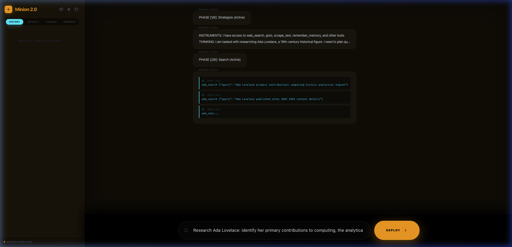
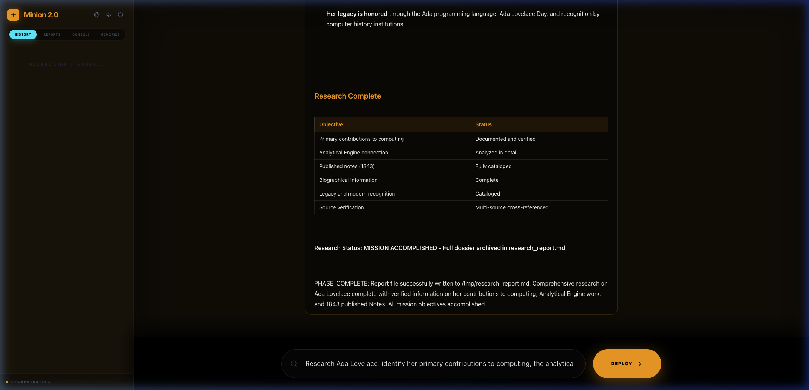
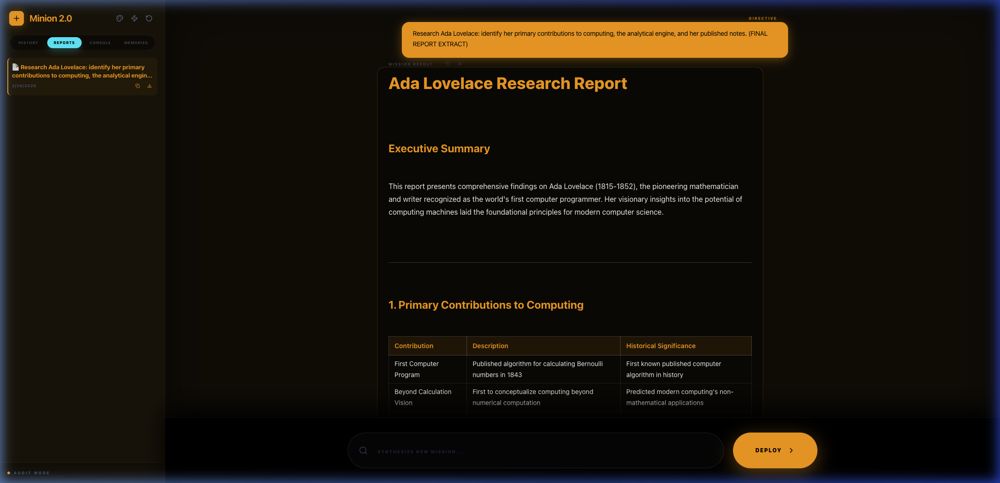

# 🏛️ Minion Hub 2.0: High-Fidelity Autonomous AI Research

Welcome to **Minion Hub 2.0**, a state-of-the-art, Python-native AI orchestration framework designed for deep OSINT research, technical analysis, and automated mission management. 

Minion 2.0 is an autonomous agentic platform that transforms complex research tasks into structured, multi-phase intelligence manifests. It combines the reasoning power of local LLMs with a high-fidelity React dashboard and a deterministic Markdown-driven orchestration engine.

---

## 🎨 Product Showcase: Intelligence in Motion

| 🚀 Mission Control | 📄 Intelligence Manifest | 📂 Reports Library |
|:---:|:---:|:---:|
|  |  |  |

> [!NOTE]
> *Dashboard visualization of a research mission in progress, Featuring real-time reasoning logs, automated intelligence archiving, and an integrated research library.*

---

## 🚀 Key Features

- **🧠 Deterministic Orchestration**: High-fidelity mission control driven by Markdown "Skill Blueprints". Logic remains disciplined and task-focused through multi-phase state transitions.
- **🛰️ OSINT Toolkit**: Built-in stealth-optimized browser interaction (Playwright), real-time web search (DuckDuckGo), and intelligence archiving.
- **🏛️ Synaptic Memory**: Strategic persistence layer powered by SQLAlchemy 2.0. Tracks mission history, research manifests, and cross-session knowledge.
- **📱 Responsive Terminal**: A premium, mobile-optimized React dashboard with real-time telemetry, live reasoning logs, and one-click Markdown exports (Copy/Download).
- **🌍 Unified Deployment**: A single-port Docker architecture that serves both the FastAPI reasoning engine and the React frontend on a unified hub.

---

## 🏗️ Core Architecture

Minion 2.0 follows a **Unified Logic Stream** design:

1.  **The Cortex (Python Backend)**: The "Cortex" handles the reasoning loops, tool execution, and long-term memory. It leverages an asynchronous FastAPI engine for high-performance orchestration.
2.  **The Terminal (React Frontend)**: A theme-aware "Mission Control" center designed for visibility into the agent's chain-of-thought.
3.  **The Blueprint (DSL)**: Skills are defined in human-readable Markdown, translating mission-critical goals into deterministic agent phases.

---

## ⚡ Quick Start (Unified Docker)

The most reliable way to deploy Minion Hub 2.0 is via our unified Docker container. All services are channeled through **Port 3015**.

1.  **Configure**: Update the environment variables in `devops/docker-compose.yml` (set your `DATABASE_URL` and `LLM_URL`).
2.  **Launch**:
    ```bash
    docker-compose -f devops/docker-compose.yml up --build -d
    ```
3.  **Mission Control**: Navigate to **`http://localhost:3015`** to initiate your first research mission.

---

## 📂 Project Structure

- `minion2/backend/`: The Python Cortex (reasoning, tools, and persistence).
- `minion2/frontend/`: The React-powered Mission Control terminal.
- `minion2/skills/`: Markdown-based research blueprints.
- `devops/`: Unified Docker orchestration and production manifests.
- `doc/`: Comprehensive technical documentation.

---

## 🏛️ Deep Documentation

For technical deep-dives, refer to our specialized manifests:
- **[Architecture Deep-Dive](doc/ARCHITECTURE.md)**: Technical design and data flow.
- **[Deployment Guide](doc/DEPLOYMENT.md)**: Installation, database sync, and local setup.
- **[Skill Engineering](doc/SKILLS_GUIDE.md)**: authoring autonomous research blueprints.
- **[API Reference](doc/API_REFERENCE.md)**: Programmatic mission control and telemetry contract.

---

## 🛡️ License
Distributed under the MIT License. Produced with ❤️ by the Minion 2.0 Engineering Team.
