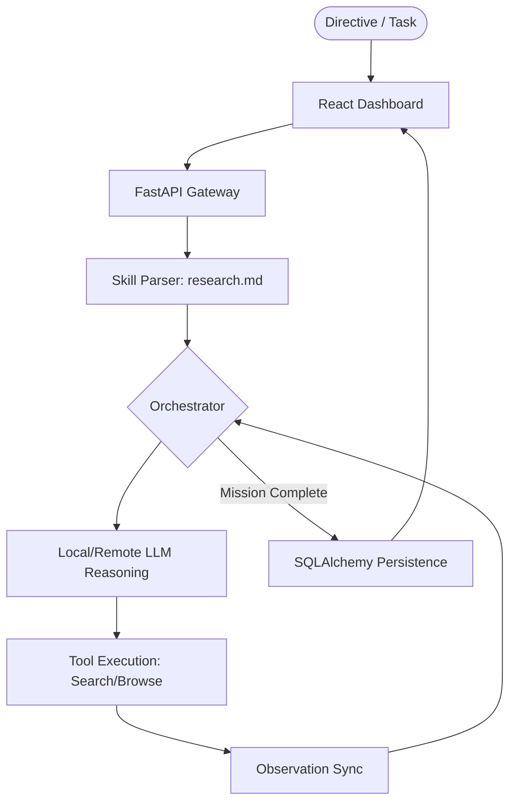

# 🏛️ Minion Hub 2.0 Architecture

Welcome to the **Minion 2.0 Native Hub**, a high-fidelity AI orchestration framework designed for deep OSINT research, technical analysis, and automated mission management. 

## Core Logical Pillars

The system is built on a **Unified Logic Stream** architecture, where a Python-native backend acts as the "Cortex" (Reasoning + Memory) and a React-powered dashboard acts as the "Terminal" (Observation + Control).

### 1. The Cortex (Backend)
Located in `backend/app/`, the Cortex is a FastAPI-driven engine responsible for:
- **Orchestration**: Managing multi-phase research missions using the `Orchestrator`. It follows a deterministic state-machine model driven by Markdown "Skill Blueprints".
- **Synaptic Memory (SQLAlchemy 2.0)**: A high-performance persistence layer that caches search results, tracks mission history, and provides long-term cross-session knowledge storage.
- **Skill Parser**: A specialized Lexer that converts human-readable Markdown files into executable JSON-blueprints for the agent's logic engine.
- **MCP Integration (Future)**: A bridge to Model Context Protocol for dynamic tool scaling.

### 2. The Terminal (Frontend)
Located in `frontend/`, this is a premium, real-time dashboard built with:
- **React + Tailwind CSS**: A theme-aware interface designed for mission-critical visibility.
- **Real-Time Telemetry**: Polling-based log streams that visualize the "Chain of Thought" as the agent reasons through its toolkit.
- **Intelligence Manifests**: One-click Markdown rendering for final research reports.

### 3. Toolset & Skills
Minion 2.0 uses an **Extensible Tool Strategy**:
- **OSINT Toolkit**: Includes `web_search` (DuckDuckGo integration) and `goto` (Playwright-based browser interaction).
- **Stealth Optimization**: Uses headless-optimized browser drivers and adaptive selectors to navigate complex web pages.
- **Calculators & Files**: Built-in math and local file interaction tools.

## Data Lifecycle

## System Requirements
- **LLM**: Ollama (locally) or OpenAI-compatible API.
- **DB**: Postgres 15+ (Local or Docker).
- **Runtime**: Python 3.12+ / Node.js 20+.
